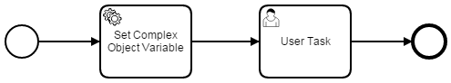

# Generated Task Form with Complex Object

This project demonstrates how to use an object variable in a [Generated Task Form's](https://docs.camunda.org/manual/latest/user-guide/task-forms/#generated-task-forms) default expression. The class is packaged with the process application, so that the process engine must switch into the context of the application in order to resolve the rendered form.

Process model:



The activity *Set Complex Object Variable* (see [SetObjectVariableDelegate](src/main/java/org/camunda/bpm/example/SetObjectVariableDelegate.java)) sets a variable of Java type [User](src/main/java/org/camunda/bpm/example/User.java) with serialization format `application/json`. The form defined for activity *User Task* makes use of the user's properties first name and last name.

```xml
<bpmn2:userTask id="UserTask_1" name="User Task" camunda:assignee="demo">
  <bpmn2:extensionElements>
    <camunda:formData>
      <camunda:formField id="firstName" label="First Name" type="string" defaultValue="${user.firstName}">
        <camunda:validation>
          <camunda:constraint name="readonly" />
        </camunda:validation>
      </camunda:formField>
      <camunda:formField id="lastName" label="Last Name" type="string" defaultValue="${user.lastName}">
        <camunda:validation>
          <camunda:constraint name="readonly" />
        </camunda:validation>
      </camunda:formField>
    </camunda:formData>
  </bpmn2:extensionElements>
  <bpmn2:incoming>SequenceFlow_0785xta</bpmn2:incoming>
  <bpmn2:outgoing>SequenceFlow_3</bpmn2:outgoing>
</bpmn2:userTask>
```

## How to use it?

1. Checkout the project with Git
2. Build the project with maven
3. Deploy the war file to a camunda BPM platform distribution
4. Go to the Tasklist and start a process instance for the process named "Generated Forms Quickstart"

